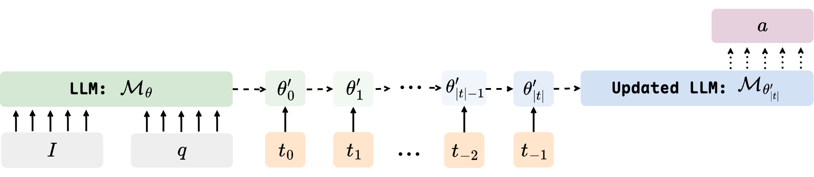

# RaML

<!-- 

   

   
   
  

 -->

> _This repository provides the codebase utilized by the paper **Deciphering Trajectory-Aided LLM Reasoning: An Optimization Perspective**_

## 📋 Introduction

We propose a novel framework for interpreting the reasoning capabilities of large language models (LLMs) through the perspective of meta-learning. By conceptualizing reasoning trajectories as pseudo-gradient descent updates to the LLM’s parameters, we identify parallels between LLM reasoning and various meta-learning paradigms. We formalize the training process for reasoning tasks as a meta-learning setup, with each question treated as an individual task, and reasoning trajectories serving as the inner loop optimization for adapting model parameters. Once trained on a diverse set of questions, the LLM develops fundamental reasoning capabilities that can generalize to previously unseen questions. Extensive empirical evaluations substantiate the strong connection between LLM reasoning and meta-learning, exploring several issues of significant interest from a meta-learning standpoint. Our work not only enhances the understanding of LLM reasoning but also provides practical insights for improving these models through established meta-learning techniques.

*Coming Soon*

<!-- ## Dependencies

- Python 3.10
- torch 2.6.0
- verl 0.3.0
- vllm 0.8.1 and above
- opencompass -->

<!-- ## Code Organization

### Data

### SFT & GRPO Training

### Evaluation on Benchmarks

###  -->

